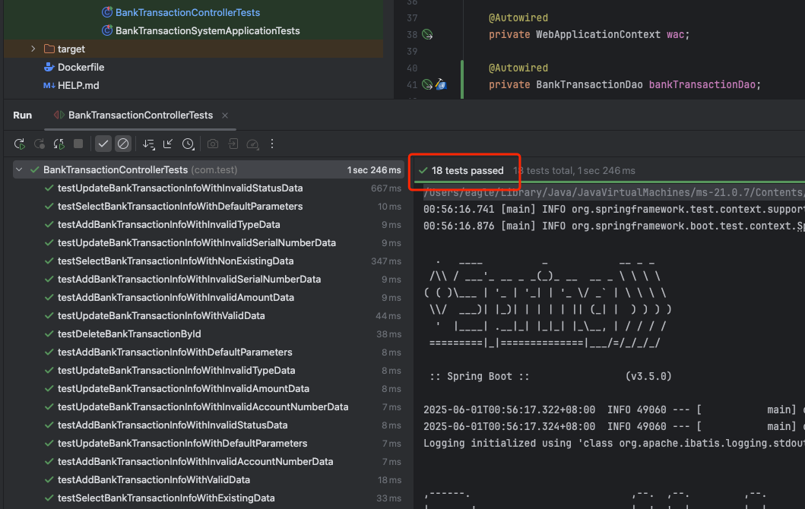

## 一、项目介绍
利用Spring Boot框架结合JDK 21，构建一个专注于银行系统内交易管理业务的API应用程序

## 二、代码组织结构
``` lua
bank_transaction_system
├── controller -- 控制器层转发处理
├── dao -- MyBatis数据交互操作
├── domain -- 定义实体类和接口返回结构公共类
├── service -- 核心业务逻辑处理
├── util -- 常量定义及异常统一处理等工具类定义
└── BankTransactionSystemApplication -- 启动入口

```
## 三、涉及技术栈介绍
| 技术                   | 说明            | 官网                                          |
|----------------------|---------------| --------------------------------------------- |
| SpringBoot           | Web应用开发框架     | https://spring.io/projects/spring-boot        |
| MyBatis              | ORM框架         | http://www.mybatis.org/mybatis-3/zh/index.html |
| MySQL8               | DB关系型数据库      | https://www.mysql.com/ |
| Caffeine              | 一个用于Java应用程序的高性能缓存框架       | https://github.com/ben-manes/caffeine          |
| Druid                | 数据库连接池        | https://github.com/alibaba/druid              |
| Lombok               | Java语言增强库     | https://github.com/rzwitserloot/lombok        |
| Hutool               | Java工具类库      | https://github.com/looly/hutool               |
| PageHelper           | MyBatis物理分页插件 | http://git.oschina.net/free/Mybatis_PageHelper |
| Hibernator-Validator | 验证框架          | http://hibernate.org/validator                |

## 四、表结构与接口设计
- 表结构
```sql
CREATE TABLE `bank_transaction` (
    `id` int(11) unsigned NOT NULL AUTO_INCREMENT COMMENT '主键',
    `serial_number` char(36) NOT NULL COMMENT '交易流水号',
    `account_number` char(16) NOT NULL COMMENT '卡号',
    `amount` decimal(15,2) NOT NULL COMMENT '交易金额(必须大于0)',
    `type` enum('DEPOSIT','WITHDRAWAL','TRANSFER') NOT NULL COMMENT '交易类型:存款/取款/转账',
    `description` varchar(255) DEFAULT NULL COMMENT '交易描述信息',
    `timestamp` datetime(6) NOT NULL DEFAULT CURRENT_TIMESTAMP(6) COMMENT '交易时间戳(精确到微秒)',
    `category` varchar(50) DEFAULT NULL COMMENT '交易分类(如:工资、购物等)',
    `status` enum('PENDING','COMPLETED','FAILED') NOT NULL DEFAULT 'PENDING' COMMENT '交易状态:处理中/已完成/已失败',
    `created_at` datetime(6) NOT NULL DEFAULT CURRENT_TIMESTAMP(6) COMMENT '记录创建时间',
    `updated_at` datetime(6) NOT NULL DEFAULT CURRENT_TIMESTAMP(6) ON UPDATE CURRENT_TIMESTAMP(6) COMMENT '记录最后更新时间',
    PRIMARY KEY (`id`),
    UNIQUE KEY `serial_num_unique` (`serial_number`)
) ENGINE=InnoDB DEFAULT CHARSET=utf8mb4 COLLATE=utf8mb4_0900_ai_ci COMMENT='银行交易表';
```
- 接口设计
> 遵循RESTful API设计原则实现了添加交易信息、修改交易信息、删除交易信息、交易信息列表分页查询四个接口

  + 路由：/bankTransaction
  
  + 接口列表：
  


## 五、接口功能测试
- 新增交易信息接口


- 更新交易信息接口


- 删除交易信息接口


- 分页查询交易信息接口


## 六、单元测试
### 1、测试结果

### 2、测试覆盖率


## 七、打包部署至K8S集群
### 1、应用打包
- 首先检查application-dev.properties文件中的MySQL配置信息，改成K8S集群中能访问的MySQL地址，MySQL信息如下图：


- 然后检查该MySQL中是否已创建表bank_transaction，不存在的话需要创建下,确保表存在

- 然后切到项目根目录下执行`mvn clean package -X` 命令对应用进行打包，执行完命令后可以看到target目录下生成了一个bank_transaction_system-0.0.1-SNAPSHOT.jar包, 如下图：


### 2、将jar包和项目根目录下的Dockerfile、k8s_deployment.yaml和k8s_service.yaml 一起上传至k8s所在master节点/data/deploy/目录下
```shell

# Dockerfile
FROM openjdk:21-ea-9
ARG JAR_FILE=/data/deploy/*.jar # 注意jar存放的位置，在k8s在master节点上构建镜像前检查jar包位置
COPY ${JAR_FILE} bank_transaction_system.jar

ENV LOG_DIR=/data/logs
ENV LOG_FILE=${LOG_DIR}/bank_transaction_system.log

RUN mkdir -p ${LOG_DIR}
ENTRYPOINT ["java","-jar","/bank_transaction_system.jar","--logging.file.name=${LOG_FILE}"]
```
```shell

# k8s_deployment.yaml
apiVersion: apps/v1
kind: Deployment
metadata:
  name: bank-transaction-system-deployment
  namespace: default
spec:
  replicas: 1
  selector:
    matchLabels:
      app: bank-transaction-system
  template:
    metadata:
      labels:
        app: bank-transaction-system
    spec:
      containers:
        - name: bank-transaction-system-container
          image: bank_trasaction_system_image_x86_jdk21:latest
          imagePullPolicy: Never # 使用本地镜像，不走远程docker仓库拉取镜像
          ports:
            - containerPort: 8088
          resources:  # 添加资源限制
            requests:
              memory: "512Mi"
              cpu: "1"
            limits:
              memory: "4Gi"
              cpu: "2"
```
```shell

# k8s_service.yaml
apiVersion: v1
kind: Service
metadata:
  name: bank-transaction-system-service
  namespace: default  # 指定命名空间
spec:
  selector:
    app: bank-transaction-system-app
  ports:
    - protocol: TCP
      port: 8080
      targetPort: 8088
  type: LoadBalancer
```

### 3、构建镜像
k8s所在master节点的/data/deploy/目录下执行以下命令
```shell

docker build -t bank_trasaction_system_image_x86_jdk21:latest .
```

### 4、k8s所在master节点上加载配置，启动应用pod
```shell

kubectl apply -f k8s_deployment.yaml
kubectl apply -f k8s_service.yaml
```
### 5、查看pod和svc是否OK


### 6、测试应用服务是否启动成功


> 接口访问ok 

## 八、接口压测
> 主要对查询接口进行性能测试

### 压测方式：
使用Apache ab工具：命令如下
`ab -n1000 -c10 http://localhost:8080/homeWork/api/v1/bankTransaction?pageNum=1"&"pageSize=2 `
记录每次压测数据：
### 1、总请求量为1000次，并发为10下的测试结果
- 第一次


- 第二次


- 第三次


### 2、总请求量为1000次，并发为20下的测试结果
- 第一次


- 第二次


- 第三次


### 3、总请求量为1000次，并发为30下的测试结果
- 第一次


- 第二次


- 第三次


### 4、总请求量为1000次，并发为40下的测试结果
- 第一次


- 第二次


- 第三次


### 5、总请求量为1000次，并发为50下的测试结果
- 第一次


- 第二次


- 第三次


### 6、总请求量为1000次，并发为80下的测试结果
- 第一次


- 第二次


### 7、总请求量为1000次，并发为100下的测试结果
- 第一次


- 第二次


### 8、总请求量为1000次，并发为150下的测试结果
- 第一次


- 第二次


### 9、总请求量为1000次，并发为200下的测试结果
- 第一次


- 第二次


> 总结：经过对以上压测数据的对比分析，在SpringBoot内嵌tomcat最大线程数为200（最大并发为200）、总请求量为1000、单节点应用配置为2核4C的测试条件下，查询API的QPS可达11000-16000，使用本地缓存加速处理，有效的提高了响应速度。